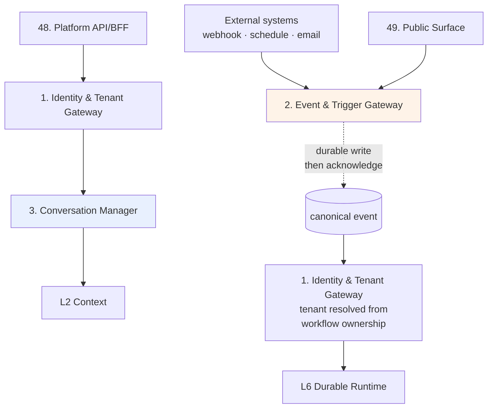
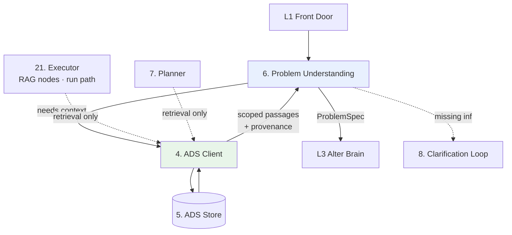
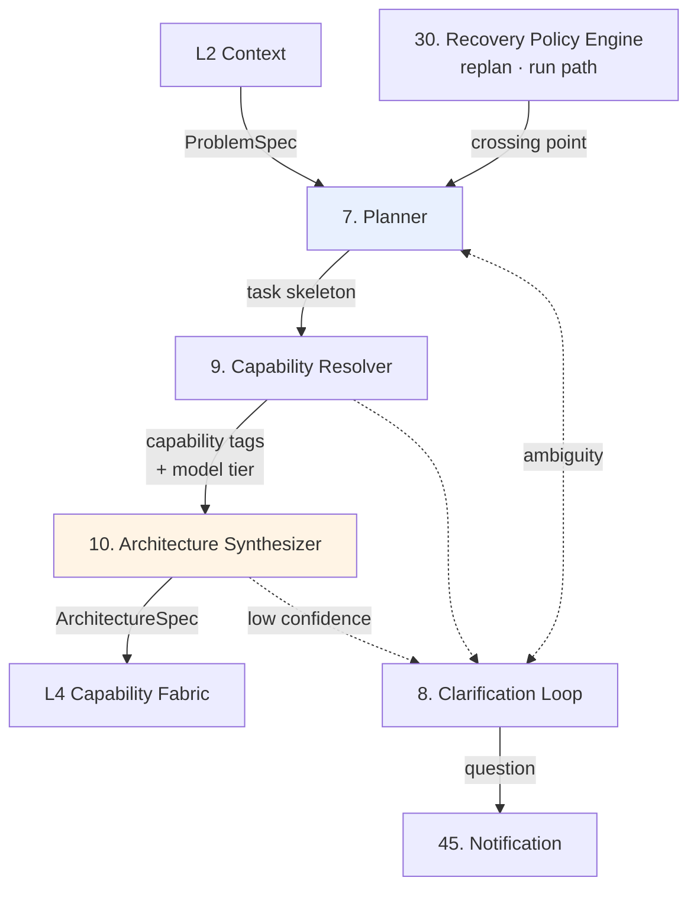
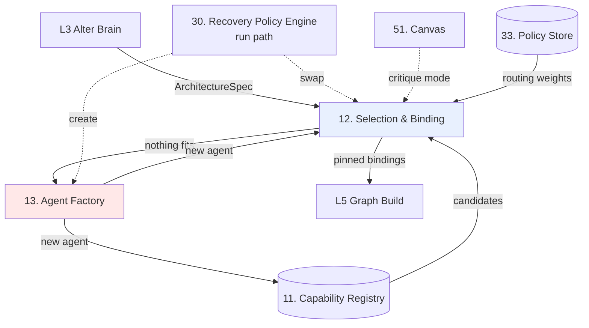
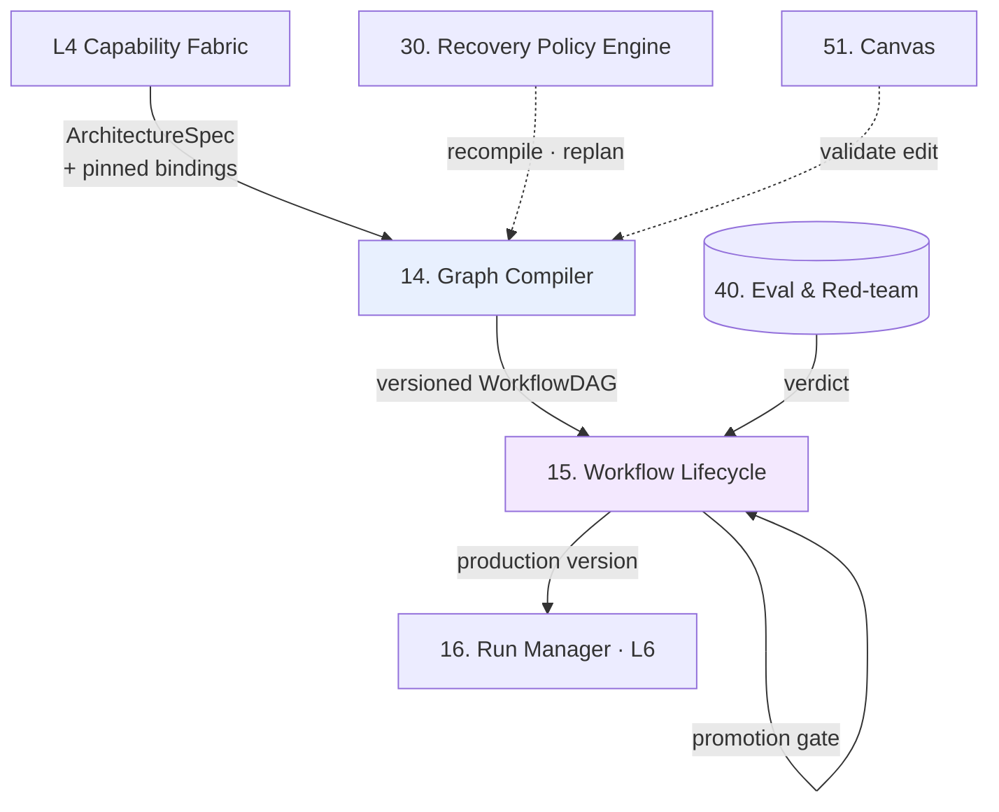
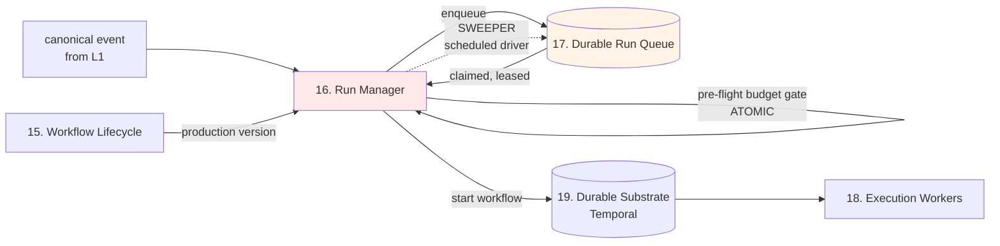
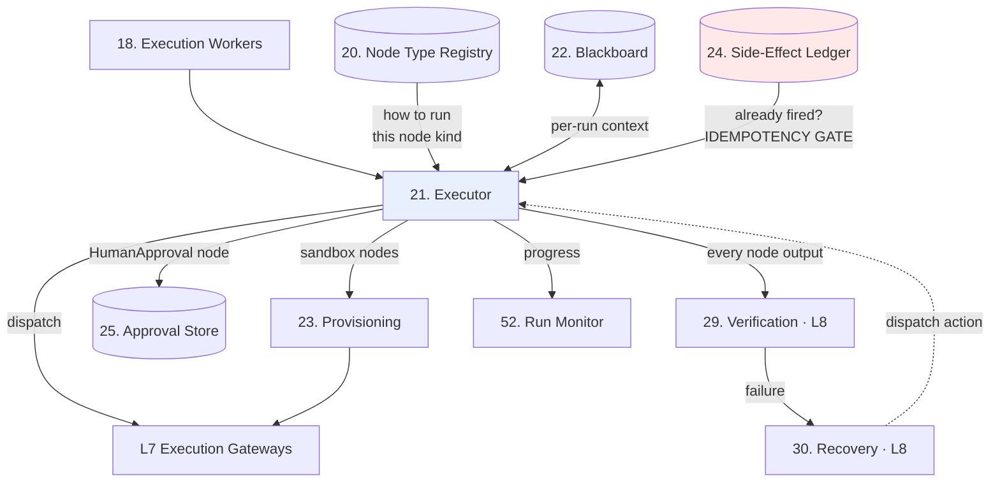
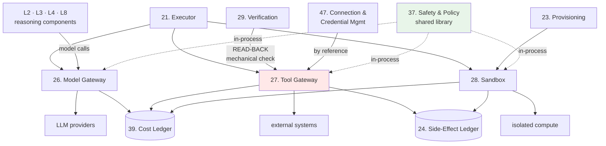
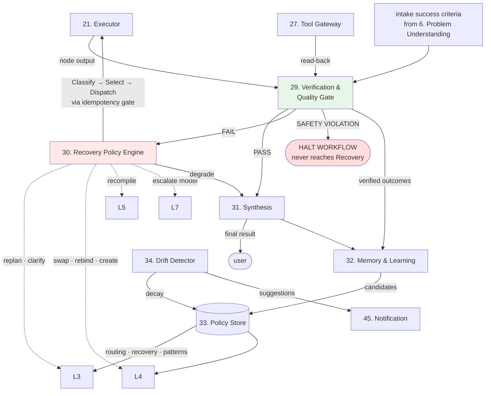

# Alter Engine — Layer Architecture

How components compose *within* each layer, and what each layer guarantees to the layers around it. Third document in the set:

1. `alter-engine-rebuild-design-log.md` — decisions and reasoning (28 sections)
2. `alter-engine-component-contracts.md` — all 54 per-component contracts
3. **this document** — layer composition and inter-layer edges
4. *(next)* plane architecture, then whole-engine architecture

Contracts give point-to-point edges between named components. This document gives the layer as a unit: what enters, what leaves, how components sequence internally, what is always true across the layer, and what downstream layers may rely on.

Started: 2026-09-01.

---

## Format

Each layer records:

| Section | Meaning |
|---|---|
| **PURPOSE** | What the layer does as a single unit |
| **COMPONENTS** | Which contracts compose it |
| **ENTRY** | What enters the layer, from where |
| **EXIT** | What leaves, to where |
| **INTERNAL ROUTES** | How components sequence — often more than one route |
| **INVARIANTS** | What is always true across the layer, regardless of route |
| **GUARANTEE** | What downstream layers may rely on without re-checking |
| **AGGREGATE BLAST RADIUS** | What breaks when the whole layer is unavailable |
| **BACK-EDGES** | Inbound edges from later layers (Recovery, in particular) |

---

## L1 — Front Door

**PURPOSE** — Accept work from the outside world, establish who owns it and what they may do, and understand what is being asked. Nothing reaches the rest of the engine without passing through here.

**COMPONENTS** — **1.** Identity & Tenant Gateway · **2.** Event & Trigger Gateway · **3.** Conversation Manager

**ENTRY**
- Authenticated human requests, from **48. Platform API/BFF**
- Anonymous public submissions, from **49. Public Surface**
- Webhooks, schedule fires, and inbound email from external systems
- Replan requests from **30. Recovery Policy Engine** *(back-edge — see below)*

**EXIT**
- To **L2 Context** — classified intent plus `ActorContext`, on the design path
- To **L6 Durable Runtime** — a canonical event plus resolved tenant, on the run path

### Internal routes — two, and they differ materially

**Design route (human present):** Platform API → **1** authenticates and resolves permissions → **3** classifies intent and tracks the active goal → L2.

**Run route (no human):** external signal → **2** validates, normalizes, and durably records, then acknowledges the caller immediately → *(async gap)* → **1** resolves tenant from workflow ownership → L6.

**Two things the contracts do not make obvious, visible only at layer level:**
1. **Component order differs by route.** On the design route, identity comes first and gates everything. On the run route, the event is received and durably recorded *before* tenant resolution — because the external caller must be acknowledged fast, and a signal that cannot be recorded must be rejected at the boundary regardless of whose it is.
2. **The run route skips 3 entirely.** There is no conversation, no intent to classify. A triggered run never touches Conversation Manager — which is exactly why that component's blast radius is "degraded, self only" rather than critical.

**INVARIANTS**
- No work proceeds past L1 without a resolved tenant. Both routes establish it; neither may skip it.
- Every entry point is authenticated, signature-verified, or explicitly anonymous-and-untrusted. There is no fourth category.
- Untrusted input is screened by **37. Safety & Policy** before leaving this layer.
- Nothing downstream re-authenticates. L1 is the single point where identity is established.

**GUARANTEE to downstream layers**
> Anything you receive carries a valid `ActorContext` with a resolved tenant and a **non-empty, role-derived permission set**. You may act on it without re-checking identity.

The emphasis is deliberate: the old build's most damaging critical defect was this guarantee being silently false — permissions hardcoded to an empty array, making 101 endpoints unreachable for every real user while every test passed.

**AGGREGATE BLAST RADIUS** — whole-engine for *new* work, both routes: nothing new enters. Runs already executing in L6 continue to completion, because their tenant context was resolved at launch and travels with the run.

**BACK-EDGES**
- **30. Recovery Policy Engine → 8. Clarification Loop** (L3) can surface a question that reaches a human through **45. Notification**, but it does not re-enter L1.
- **No layer re-enters L1 for identity.** Tenant scope propagates forward with the run (Rule 16); nothing downstream calls back to re-establish it.

---

## L2 — Context

**PURPOSE** — Load the right context, and turn an ambiguous human request into a structured problem statement the rest of the engine can reason from.

**COMPONENTS** — **4.** ADS Client · **5.** ADS Store · **6.** Problem Understanding

**ENTRY**
- Classified intent plus `ActorContext` from **L1** (design path)
- Retrieval requests from **21. Executor** for RAG-type nodes (run path) *(see dual-path note)*
- Retrieval requests from **7. Planner** (L3)

**EXIT**
- `ProblemSpec` → **L3 Alter Brain**
- Retrieved context → back to whichever component asked

**INTERNAL ROUTE** — **6** receives the classified intent, requests context from **4**, which queries **5** under enforced tenant scope and returns ranked passages with provenance. **6** assembles the typed `ProblemSpec`. Missing information routes to **8. Clarification Loop** rather than being invented.

**Dual-path note, visible only at layer level:** L2 looks like a design-path layer, but **4. ADS Client is dual-path** — RAG-type nodes call it at run time through **21. Executor**. So an L2 outage is not confined to the design path: workflows containing retrieval nodes fail at those nodes. **5. ADS Store** and **6. Problem Understanding** are design-path-only.

**INVARIANTS**
- Every retrieval carries enforced tenant, workspace, and permission scope. No component may query **5** except through **4** (Rule 23).
- Default retrieval scope is the current workflow; cross-workflow retrieval happens only on explicit request.
- Every returned passage carries provenance.
- **A `ProblemSpec` without success criteria may not leave this layer.**

**GUARANTEE to downstream layers**
> The `ProblemSpec` you receive is complete, typed, and carries **explicit success criteria** — or it did not leave this layer at all.

That guarantee is what makes verification possible at the far end of the engine. Design log Section 5 requires intake to capture checkable success criteria because **29. Verification & Quality Gate** later judges against exactly them. If this guarantee is weak, verification has nothing real to check.

**AGGREGATE BLAST RADIUS** — design path stops entirely; run path degrades only for workflows containing retrieval nodes.

**BACK-EDGES**
- **7. Planner** (L3) calls **4** for additional context during decomposition.
- **21. Executor** (L6) calls **4** for run-time retrieval.

---

## L3 — Alter Brain

**PURPOSE** — Decide what system should exist to solve this problem. The moat.

**COMPONENTS** — **7.** Planner · **8.** Clarification Loop · **9.** Capability Resolver · **10.** Architecture Synthesizer

**ENTRY**
- `ProblemSpec` from **L2**
- Replan requests from **30. Recovery Policy Engine** *(the crossing point — see back-edges)*
- Ambiguity signals into **8** from L1, L2, and L8

**EXIT**
- `ArchitectureSpec` → **L4 Capability Fabric**
- Questions → **45. Notification** → the user

**INTERNAL ROUTE** — **7** decomposes the ProblemSpec into a task skeleton. **9** determines what capability each node requires, as tags and a model tier, naming no provider. **10** decides the actual system topology and emits the `ArchitectureSpec`. **8** sits alongside all three as a loop-back any of them may invoke when uncertainty materially blocks progress.

**The order is deliberate and was ruled explicitly** (Rules 7–9): requirements are determined *before* topology, and independently of what happens to be available. **9** does not query the Registry — that is correct, not an oversight.

**INVARIANTS**
- No component in this layer names a provider, model, or concrete agent. Output is roles and requirements only.
- No component in this layer compiles anything (Rule 6).
- Determining requirements (**9**), describing what exists (**11**, in L4), and choosing implementations (**12**, in L4) remain three separate concepts. Collapsing any two is the most likely architectural error in the engine.
- Low confidence asks rather than guessing — at every one of the three stages.

**GUARANTEE to downstream layers**
> The `ArchitectureSpec` you receive is a complete system design — topology, roles, gates, parallelism, termination conditions — with **zero concrete bindings**. Choosing implementations is yours.

**AGGREGATE BLAST RADIUS** — this-layer-only, with a run-path consequence: new design stops, **and the `replan` recovery strategy becomes unavailable**, because **7** is where the crossing point lands.

**BACK-EDGES**
- **30. Recovery Policy Engine → 7. Planner.** This is the single crossing point between the run path and the design path (design log Section 24). Everything else in L3 is design-path-only.
- **30 → 8. Clarification Loop**, for the `ask_user` strategy and the ambiguous-outcome bucket.

---

## L4 — Capability Fabric

**PURPOSE** — Turn abstract requirements into concrete, usable implementations — finding what exists, choosing among it, and authoring something new when nothing fits.

**COMPONENTS** — **11.** Capability Registry · **12.** Selection & Binding · **13.** Agent Factory

**ENTRY**
- `ArchitectureSpec` from **L3**
- Swap, rebind, and create requests from **30. Recovery Policy Engine** (run path)
- Critique-mode comparison requests from **51. Canvas** via Platform API

**EXIT**
- Pinned binding decisions → **L5 Graph Build**
- New agent definitions → registered into **11**, returned to the caller
- Materiality comparisons → back to **51. Canvas**

**INTERNAL ROUTE** — **12** receives the ArchitectureSpec, queries **11** for candidates, scores them across the full factor set, and pins a decision per requirement. When nothing fits, it calls **13**, which authors a new agent, registers it into **11** under the requesting tenant, and returns it for immediate binding.

**INVARIANTS**
- **This entire layer is dual-path.** All three components are called by **30. Recovery Policy Engine** during self-heal, not only by the design chain. That is precisely why **13** is a separate component rather than living inside **12** (design log Section 22).
- Tenant-owned registry entries (agents) never appear as candidates for another tenant. System-owned entries (models, built-in tools, hand-authored templates) are shared by design.
- Scoring uses the full factor set, and each factor's contribution is inspectable afterward.
- **Policy unavailability fails closed and loud** — never a silent revert to hardcoded defaults.

**GUARANTEE to downstream layers**
> Every requirement in the ArchitectureSpec has a concrete, pinned, permission-checked binding — or this layer refused rather than guessing.

**AGGREGATE BLAST RADIUS** — this-layer-only. Compiled workflows keep running on bindings already baked into their DAGs. New design stops, **and the swap-agent, rebind, and create-new recovery strategies all become unavailable** — a substantially degraded self-heal.

**BACK-EDGES**
- **30 → 12** (swap, rebind) and **30 → 13** (create new) — the run path's self-heal reaching into this layer.
- **51. Canvas → 12** in critique mode, producing the materiality pushback on a manual override.

---

## L5 — Graph Build

**PURPOSE** — Compile an approved architecture into a versioned, executable graph, and own that workflow's lifecycle.

**COMPONENTS** — **14.** Graph Compiler · **15.** Workflow Lifecycle

**ENTRY**
- `ArchitectureSpec` plus pinned bindings from **L4**
- Recompile and replan requests from **30. Recovery Policy Engine**
- Manual-edit validation requests from **51. Canvas**
- Promotion and rollback requests from **48. Platform API/BFF**
- Evaluation verdicts from **40. Eval & Red-team**

**EXIT**
- Versioned `WorkflowDAG` → **15**, and at run time the production version → **16. Run Manager** (L6)
- Validation results → back to **51. Canvas**

**INTERNAL ROUTE** — **14** compiles and validates, producing a versioned DAG. **15** manages that DAG's states: Draft → Test → Evaluation → Publish → Canary → Production → Rollback, gating every production promotion through **40. Eval & Red-team**.

**INVARIANTS**
- **Exactly one compile entry point exists.** Every route to a compiled workflow — including Recovery's recompile and replan — passes through the same path, which requires an approved ArchitectureSpec and pinned bindings. The old build's second, legacy path bypassed L3 and L4 entirely and was reachable from Recovery.
- An invalid DAG never compiles, is never stored, and is never executed. Validation runs again when a DAG is claimed for execution.
- **15 sits off the run path.** A run resolves its version and executes; it never waits on lifecycle logic. That was the entire point of restructuring Deployment Controller into Workflow Lifecycle.
- Publishing a new version never mutates runs already executing against a previous one.

**GUARANTEE to downstream layers**
> Any `WorkflowDAG` you receive is fully validated — no cycles, no orphans, no dangling edges, wave integrity intact, within size limits — and its version is stable for the life of your run.

**AGGREGATE BLAST RADIUS** — this-layer-only. Runs continue on their current production versions. New compilation stops, recompile-class recovery stops, and — the genuinely uncomfortable part — **rollback becomes unavailable while a bad version may be live**.

**BACK-EDGES**
- **30 → 14** for recompile and replan. Branch-level recompile must be genuinely narrower than a full replan, which requires **14** to accept an ArchitectureSpec *delta*. In the old build this was structurally impossible, so the two strategies collapsed into one.
- **51. Canvas → 14** reusing the same validator for manual-edit impact analysis, never a duplicate implementation.

---

## L6 — Durable Runtime

**PURPOSE** — Execute compiled workflows reliably and at scale, surviving crashes, restarts, and long waits. The run path's core.

**COMPONENTS** — **16.** Run Manager · **17.** Durable Run Queue · **18.** Execution Workers · **19.** Durable Substrate *(Temporal, external)* · **20.** Node Type Registry · **21.** Executor · **22.** Blackboard · **23.** Provisioning · **24.** Side-Effect Ledger · **25.** Approval Store

**ENTRY**
- Canonical events from **L1** (run path)
- Manual run requests via **48. Platform API/BFF**
- Production DAG version from **15. Workflow Lifecycle**
- Recovery dispatch actions from **30. Recovery Policy Engine**

**EXIT**
- Dispatches → **L7 Execution Gateways**
- Node outputs → **29. Verification & Quality Gate** (L8)
- Failures → **30. Recovery Policy Engine** (L8)
- Live progress → **52. Run Monitor**

### Sub-flow A — dispatch

> The sweeper edge is drawn deliberately. In the old build it did not exist: `dispatchNextQueuedRun` was invoked from exactly one place — immediately after enqueueing — and a repository-wide search for every scheduler primitive returned zero matches. Runs could sit in `pending` forever.

### Sub-flow B — execution

**INTERNAL ROUTE** — **16** resolves the production version, runs the atomic pre-flight budget gate, and enqueues to **17**. Its scheduled sweeper drains the queue and starts the workflow on **19**. **18** claims work and delegates to **21**, which asks **20** how each node kind runs, reads and writes shared context through **22**, consults **24** before any re-execution, provisions through **23** for sandbox nodes, dispatches to L7, and hands every output to L8 for verification.

**INVARIANTS**
- **Durability is infrastructure-backed, never hand-rolled** (Rule 12). No custom retry logic, no bespoke state machine, no home-grown replay.
- **No external effect is performed without being recorded first** (**24**). If the ledger is unavailable, effect-performing nodes do not run.
- **No re-execution occurs without consulting the idempotency gate.** Every recovery path leading back into execution passes through it.
- Every node output is verified before execution advances past it — including nodes the user configured by hand.
- Every queue consumer uses the visibility-timeout pattern. Nothing is deleted on receipt.
- Attempts are bounded, with a dead-letter path and an operator signal.

**GUARANTEE to downstream layers**
> Every dispatch you receive carries full run context and tenant scope, and its result **will** be verified. Nothing advances on an unverified output.

**AGGREGATE BLAST RADIUS** — the entire run path stops. Design work continues normally. Durable state is preserved: runs resume where they stopped once the layer returns, because **19** holds the history.

**BACK-EDGES**
- **30. Recovery Policy Engine → 21. Executor** — retry, swap, and degrade actions dispatched back into execution, each passing the idempotency gate first.
- **29. Verification → 21** — per-node verdicts gating advancement.
- **48. Platform API/BFF → 25. Approval Store** — human decisions resuming a paused run.

---

## L7 — Execution Gateways

**PURPOSE** — The only doors to models, tools, and code execution. Nothing else in the engine may reach an external provider directly (Rule 10).

**COMPONENTS** — **26.** Model Gateway · **27.** Tool Gateway · **28.** Sandbox

**ENTRY**
- Dispatches from **21. Executor** (run path)
- Model calls from every reasoning component in L2, L3, L4, and L8 (design path)
- **Read-back requests from 29. Verification & Quality Gate**
- Prepared environments from **23. Provisioning**
- Credentials from **47. Connection & Credential Management**

**EXIT**
- Results → the calling component
- Effect records → **24. Side-Effect Ledger**
- Cost events → **39. Cost Ledger**
- Performance outcomes → **34. Drift Detector**

**INTERNAL ROUTE** — no sequencing between the three; they are parallel doors chosen by node kind. **26** serves both paths, since every reasoning component in the engine calls it. **27** performs external actions *and* serves verification's read-back. **28** handles isolated computation only.

**INVARIANTS**
- **Nothing bypasses these gateways.** No component anywhere holds provider credentials, imports a vendor SDK outside a provider adapter, or opens an outbound connection directly.
- **37. Safety & Policy runs in-process** in all three — one shared library, never reimplemented (design log Section 11). The old build reimplemented the same fetcher protection twice and they drifted: Sandbox passed a 1 MB response bound, Tool Gateway passed none.
- Every external interaction is permission-checked, size-bounded, rate-limited, recorded, and audited on every branch — success, denied, and error alike.
- **28** owns isolated computation only. Browser, database, search, and business APIs belong to **27** (Rule 11).

**GUARANTEE to callers**
> Every external interaction was permission-checked, bounded, recorded in the Side-Effect Ledger, cost-attributed, and audited. An unimplemented capability fails loudly — it is never silently mocked.

**AGGREGATE BLAST RADIUS** — the widest of any layer, because it spans both paths: run-path nodes fail, design-path reasoning fails, **and mechanical verification cannot run**. Under fail-closed rules, unverifiable runs are marked failed rather than passed.

**BACK-EDGES**
- **29. Verification → 27** for read-back — the edge that makes a Tool Gateway outage a verification outage too.
- **30. Recovery → 26** for `escalate_model` and provider switching, which act *through* the gateway rather than around it.

---

## L8 — Verify, Heal & Learn

**PURPOSE** — Decide whether it actually worked, repair the smallest broken layer when it did not, deliver the result, and learn safely from verified outcomes.

**COMPONENTS** — **29.** Verification & Quality Gate · **30.** Recovery Policy Engine · **31.** Synthesis · **32.** Memory & Learning · **33.** Policy Store · **34.** Drift Detector

**This is the layer that reaches backward into every other layer.** Recovery dispatches into L3 (replan, clarify), L4 (swap, rebind, create), L5 (recompile), L6 (retry), and L7 (escalate model). Policy Store feeds L3 and L4. No other layer has this reach — which is why its contracts carry the most cross-layer detail.

**ENTRY**
- Node outputs and failures from **21. Executor**
- Read-back results from **27. Tool Gateway**
- Intake success criteria, captured by **6. Problem Understanding**
- Performance outcomes from **26** and **27**

**EXIT** — verdicts to L6; recovery actions into L3/L4/L5/L6/L7; final results to the user; learning into **33**; suggestions to **45. Notification**

**INTERNAL ROUTE** — **29** verifies each node mechanically and semantically, then the whole run holistically. Passing outputs reach **31**; failures reach **30**, which classifies, selects a strategy, and dispatches — always through the idempotency gate. Safety violations halt at **29** and never reach **30**. Verified outcomes flow to **32**, which proposes candidates to **33**, which feeds routing and recovery preferences back into L3 and L4. **34** decays stale policy and surfaces improvement suggestions to the user.

**INVARIANTS**
- **Fail-closed, everywhere.** Unverifiable means failed or needs-review; never a silent pass.
- **Verification precedes learning** (Rule 13). A failed run produces no learning candidate.
- **Safety violations halt here and never enter Recovery.** Recovery's job is to continue; a safety violation is the one case where continuing is wrong.
- **Repair happens at the smallest broken layer** (Rule 15) — provider, agent, tool, node, branch, workflow, problem — not by restarting everything.
- **Learning updates versioned policy, never engine code** (Rule 14).
- The reviewer never treats judged output as instruction.
- Self-heal is autonomous with notify-after; proactive improvement only ever suggests.

**GUARANTEE to the user**
> Nothing is reported successful that was not actually checked. A partial result is labeled partial. Every autonomous repair is disclosed after the fact.

**AGGREGATE BLAST RADIUS** — severe and multi-part: nothing can be marked successful (so runs stall or fail under fail-closed rules), failures cannot be repaired, results cannot be assembled, and learning stops. Individually the components degrade differently — **32**, **33**, and **34** are degraded-self-only — but **29** and **30** together are what make the run path trustworthy.

**BACK-EDGES OUT** *(this layer's defining property)*
- **30 → 7. Planner** (L3) — replan, the single design-path crossing point
- **30 → 8. Clarification Loop** (L3) — ask-user and the ambiguous-outcome bucket
- **30 → 12, 13** (L4) — swap agent, rebind, create new
- **30 → 14** (L5) — recompile branch
- **30 → 21** (L6) — retry, via the idempotency gate
- **30 → 26** (L7) — escalate model, switch provider
- **33 → 10, 12** — learned architecture preferences and routing weights
