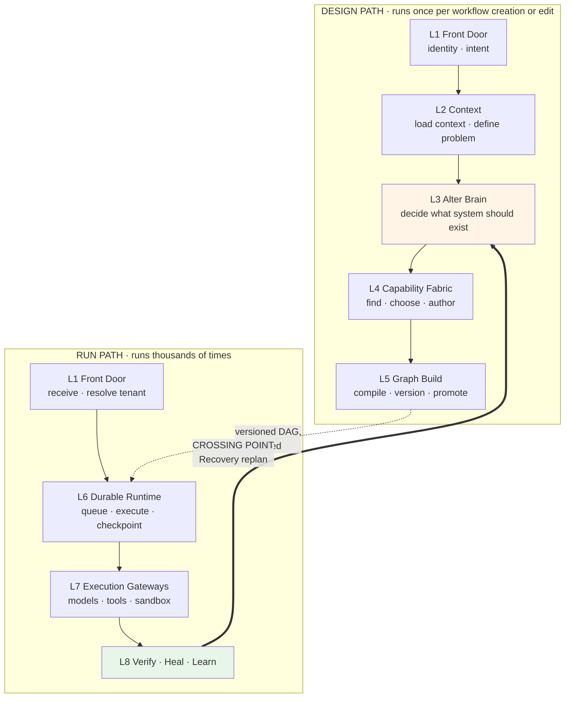
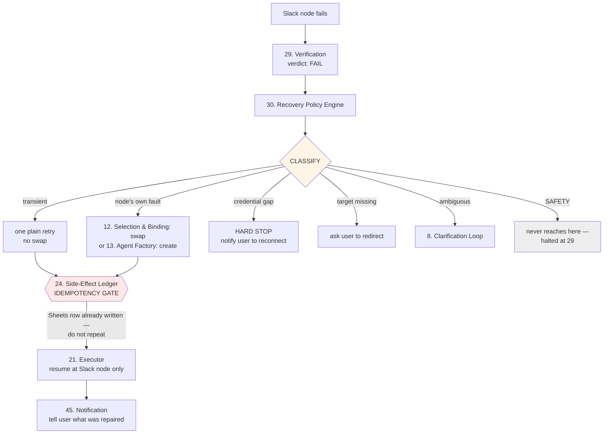
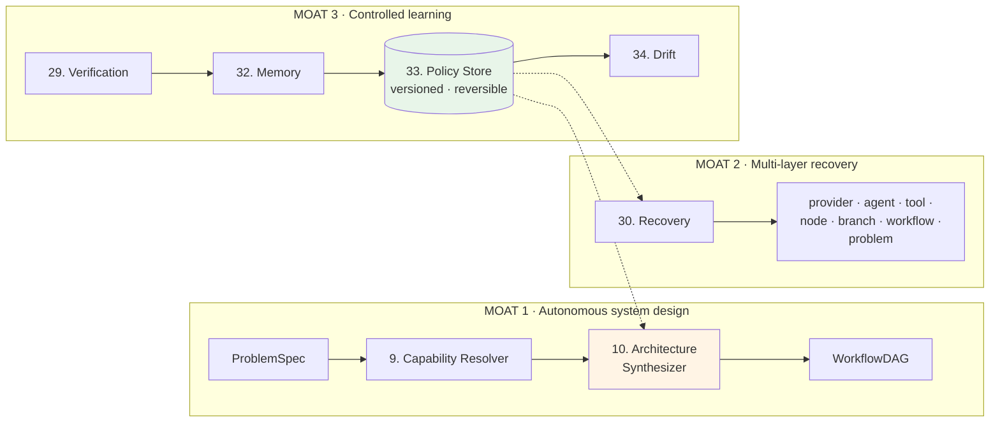

# Alter Engine — Whole Architecture

Fifth and final document in the architecture set:

1. `alter-engine-rebuild-design-log.md` — decisions and reasoning (28 sections)
2. `alter-engine-component-contracts.md` — 54 component contracts
3. `alter-engine-layer-architecture.md` — L1–L8 composition
4. `alter-engine-plane-architecture.md` — planes and the Account/Control plane
5. **this document** — the engine as one system

Started: 2026-09-01. Nothing built yet — this is design, deliberately completed before code.

---

## 1. The two paths

The engine is not one pipeline. It has two, meeting at exactly one point.

**Design path** — a human describes an objective; Alter decides what system should exist, binds real implementations, and compiles a versioned graph. Reasoning-heavy, slow, expensive. Rare.

**Run path** — a trigger fires; an already-compiled graph executes, is verified, and repairs itself. Fast, frequent, never touches the Planner.

**The crossing point** — Recovery's `replan`, when a failure indicates the workflow's *design* is wrong rather than its execution. One edge, and the only one.

> Reading these as a single L1→L8 pipeline implies every run passes through the Planner — the equivalent of rewriting the recipe from scratch every time you cook. It also gives every component the wrong performance and blast-radius profile.

---

## 2. End-to-end trace — design time

*A user opens Alter and types: "When someone fills out my contact form, save them to my leads spreadsheet and tell my sales team on Slack."*

| Step | Component | What happens |
|---|---|---|
| 1 | **48. Platform API/BFF** | Authenticated request arrives from **50. Chat & Workflow Builder** |
| 2 | **1. Identity & Tenant Gateway** | Validates JWT, resolves tenant, derives permissions from roles via **42** |
| 3 | **3. Conversation Manager** | Classifies intent: *build a new workflow*. Tracks active goal |
| 4 | **6. Problem Understanding** | Requests context from **4. ADS Client**, which queries **5. ADS Store** scoped to this workflow |
| 5 | **6** | Assembles `ProblemSpec` — **including explicit success criteria**: a row exists in the sheet with the submitted fields; a message posts to #sales-leads naming the lead and company |
| 6 | **8. Clarification Loop** | *(if criteria or systems are unclear)* asks the user; otherwise skipped |
| 7 | **7. Planner** | Decomposes into a task skeleton: receive submission → persist → notify |
| 8 | **9. Capability Resolver** | Per node: capability tags plus model tier. Names no provider |
| 9 | **10. Architecture Synthesizer** | Decides topology — three nodes, sequential, no agent needed for persistence, no human gate. Emits `ArchitectureSpec` |
| 10 | **11. Capability Registry** | Returns candidates: Sheets connector, Slack connector, form trigger |
| 11 | **12. Selection & Binding** | Scores and pins concrete bindings across the full factor set |
| 12 | **13. Agent Factory** | *(not invoked — existing capabilities fit)* |
| 13 | **47. Connection & Credential Mgmt** | **Batch-asks** for Google and Slack connections now that the full tool list is known |
| 14 | **14. Graph Compiler** | Compiles `WorkflowDAG`, validates: no cycles, no orphans, waves intact, within size caps |
| 15 | **15. Workflow Lifecycle** | Draft → Test → Evaluation, gated by **40. Eval & Red-team** → Published |
| 16 | **49. Public Surface** | Hosts the public form at a real URL |
| 17 | **51. Canvas** | Renders the **live DAG** — never a mock — for review and editing |

**Planes touched throughout:** **35** (every typed handoff), **36** (traced), **37** (user input screened), **38** (decisions audited), **39** (model calls costed).

---

## 3. End-to-end trace — run time

*3:00am Tuesday. A stranger submits the form. Nobody is watching.*

| Step | Component | What happens |
|---|---|---|
| 1 | **49. Public Surface** | Receives anonymous submission. Screened by **37**, rate-limited |
| 2 | **2. Event & Trigger Gateway** | Validates, normalizes to canonical event, **writes durably, acknowledges immediately** — sign-and-release |
| 3 | **1. Identity & Tenant Gateway** | Resolves tenant from workflow ownership via **46**. No human actor |
| 4 | **16. Run Manager** | Resolves production version from **15**; runs **atomic pre-flight budget gate** against **39**; enqueues |
| 5 | **17. Durable Run Queue** | Entry leased. **16's scheduled sweeper** drains it — not the next launch |
| 6 | **19. Durable Substrate** | Workflow started on Temporal; state now crash-durable |
| 7 | **18. Execution Workers** | Claims the work, delegates to **21** |
| 8 | **21. Executor** | Asks **20** how to run node 1. Consults **24** — nothing fired yet |
| 9 | **27. Tool Gateway** | Writes the row to Sheets. Records **intent then confirmation** in **24**. Costed in **39**, audited in **38** |
| 10 | **29. Verification** | **Mechanical:** reads the sheet back through **27** — row present, values correct. **Semantic:** output matches this node's sub-task. Pass |
| 11 | **22. Blackboard** | Node 1 output stored; node 2 inherits it without re-prompting |
| 12 | **21** → **27** | Posts to #sales-leads. Effect recorded in **24** |
| 13 | **29. Verification** | Reads Slack back: message exists, names the right lead and company. Pass |
| 14 | **29. Verification** | **Holistic check** — combined outcome against the intake success criteria from step 5 of design time. Pass |
| 15 | **31. Synthesis** | Assembles the final result |
| 16 | **32. Memory & Learning** | Verified outcome → learning candidate with provenance and confidence |
| 17 | **33. Policy Store** | Candidate recorded, versioned, reversible |
| 18 | **39. Cost Ledger** | Cost attributed with **verification verdict recorded** — making verified-run billing possible |

**Nobody was awake. Nothing blocked. Everything was checked.**

---

## 4. End-to-end trace — failure and self-heal

*Same run, but the Slack node fails.*

**Three things this trace demonstrates that a single-strategy retry cannot:**
1. **Classification precedes action.** A transient blip gets a cheap retry; a broken agent gets replaced; an expired token stops and asks, because no amount of swapping fixes a credential.
2. **The idempotency gate prevents the repair from causing harm.** The Sheets row was already written. Without **24**, retrying duplicates the lead.
3. **Repair is scoped to the smallest broken layer.** Only the Slack node re-runs. The workflow is not restarted, and the design is not re-planned.

---

## 5. The moat, drawn

Design log Section 1: the differentiator is that nothing in the market decides *what system should exist*. That claim is structural, not aspirational — it is these three mechanisms.

**Moat 2 is visible as L8's back-edges** — Recovery reaching into L3 (replan, clarify), L4 (swap, rebind, create), L5 (recompile), L6 (retry), L7 (escalate model). No other layer has that reach. Most systems' entire failure handling is the single L6 edge.

**Moat 3 is a loop, and its direction matters.** Verified outcomes feed policy; policy feeds architecture and routing decisions; drift decays what goes stale. Learning updates *versioned, reversible policy*, never engine code (Rule 14) — which is exactly why design log Section 3 chose it over a neural approach it could not inspect or roll back.

---

## 6. System-wide invariants

True everywhere, in every component, on both paths.

**Identity and isolation**
- Tenant scope is established once at L1 and propagates forward with the run. Nothing re-establishes it (Rule 16).
- Permissions are derived from roles. A permission set is never empty by construction.
- Resources belong to the tenant, not the member who created them.
- Cross-tenant access is impossible at the storage layer, not merely at the guard.

**Boundaries**
- Requirements (**9**), availability (**11**), and choice (**12**) are three separate concepts (Rules 7–9).
- Architecture Synthesizer owns topology; Graph Compiler compiles it (Rules 5–6).
- Every external interaction passes a gateway (Rule 10).
- Sandbox is isolated computation only (Rule 11).
- Durability is infrastructure-backed, never hand-rolled (Rule 12).

**Truth**
- **Fail-closed by default.** Unverifiable means failed or needs-review — never a silent pass.
- Verification precedes learning (Rule 13).
- No external effect is performed without being recorded first.
- No re-execution occurs without consulting the idempotency gate.
- A judged output is never treated as instruction.
- Cost never silently degrades quality.

**Structure**
- Every scheduled or background capability has a named driver **and a test asserting that driver exists**.
- Every shared primitive has exactly one definition.
- Every component holding tenant data registers with **44**, enforced in CI.
- No mock exists in a production path; an unimplemented capability fails loudly.
- In production mode, selecting any mock provider is a fatal startup error.

---

## 7. Component census

| Group | Count | Notes |
|---|---:|---|
| **Engine L1–L8** | 34 | The execution core, both paths |
| **Cross-cutting planes** | 7 | One deferred (**41. Cache**) |
| **Account/Control plane** | 6 | One deferred (**43. Billing**) |
| **Surfaces** | 7 | Built thin-first, incrementally |
| **Total** | **54** | 52 to build, 2 deliberately deferred |

**Components, not services.** Several will share a deployable. The old build ran 30 components across 15 services — a comparable ratio.

---

## 8. What "done" means

The design is complete when every contract's done gate passes against **real execution** — never fixtures, never mocks (design log Section 6).

**Nine driver-exists tests**, each targeting the old build's most expensive failure pattern — correct machinery that nothing ever turned:

| # | Driver test |
|---|---|
| 1 | A queued run dispatches **with nothing else happening in the system** |
| 2 | A scheduled trigger fires on time, unprompted |
| 3 | ADS content becomes retrievable after ingestion |
| 4 | Registry availability updates when a provider degrades |
| 5 | A timeout-mode approval resolves with no human present |
| 6 | Run history past its retention window is deleted automatically |
| 7 | Drift evaluation runs on schedule |
| 8 | **The audit chain verifier runs and detects a tampered entry** |
| 9 | A credential expiry warning fires before expiry |

**Three tests against the old build's most damaging defects:**
- **Canvas:** load-then-save round-trips the real DAG unchanged *(the stub that wrote)*
- **Deletion:** a tenant table added without registration fails the build *(the list that went stale)*
- **Recovery:** a transient error retries and succeeds, and is never treated as terminal *(the catch that dropped runs)*

**And the honest one, from design log Section 1:** a live run, mid-failure, creates a new agent, binds it, and resumes. Nobody in the industry has shipped that working — including the old build, whose equivalent strategy was stubbed as *"no real target system wired yet."* If any part of this architecture proves optimistic, it is that line.

---

## 9. Open items carried into build

| Item | Source | Status |
|---|---|---|
| Credit pricing and free-tier limits | §21 | User defines; infrastructure built with values as configuration |
| Approval notification delivery channels | §16 | Push, email, in-app — settle before the approval flow is built end-to-end |
| Classify bucket refinement | §4 | Provisional by design; expect revision once real testing surfaces unimagined failures |
| Project Mode | §23 | Out of v1; Sandbox and Provisioning kept small so it remains addable, never a rearchitecture |

---

*Design complete. No code written — deliberately. Next: the repository, one folder per component, each carrying its contract as its README.*
